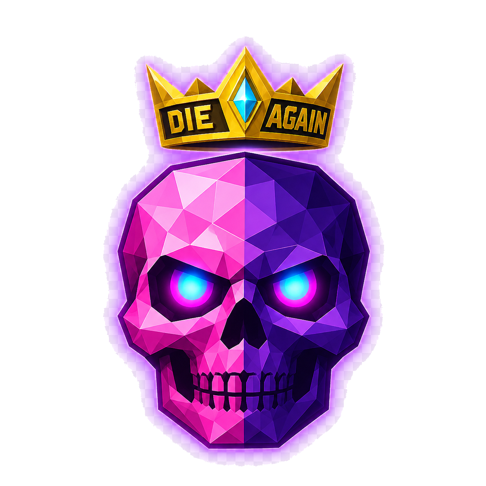

<div align="center">

# Die Again — Troll Game



**A 3D platformer where dying is the puzzle.**

Ten themed levels, each built around a different way to ruin your day. Hardcore mode with 3 tries per level, a Shop economy, upgradable potions, achievements, a global Firebase leaderboard, and a Tauri desktop wrap. Built with React + react-three-fiber.

[**Play on the Web**](https://die-again-troll-game.vercel.app) · [**Download for Windows**](https://github.com/SammamMahdi/Die-Again-Troll-Game/releases/latest) · [**Issues**](https://github.com/SammamMahdi/Die-Again-Troll-Game/issues)

</div>

---

## Table of Contents

- [The pitch](#the-pitch)
- [Levels](#levels)
- [Game modes](#game-modes)
- [Medals & scoring](#medals--scoring)
- [The jewel economy](#the-jewel-economy)
- [Shop](#shop)
- [Consumables](#consumables)
- [Achievements](#achievements)
- [Controls](#controls)
- [Accounts & cloud sync](#accounts--cloud-sync)
- [Local development](#local-development)
- [Desktop build (Tauri)](#desktop-build-tauri)
- [Distribution & versioning](#distribution--versioning)
- [Project structure](#project-structure)
- [Tech stack](#tech-stack)
- [Architecture notes](#architecture-notes)
- [Troubleshooting](#troubleshooting)
- [Privacy](#privacy)
- [Contributing](#contributing)
- [License & credits](#license--credits)

---

## The pitch

Most platformers want you to feel competent. Die Again wants you to feel *outsmarted*. Every level is a different lie — the path that looks safe drops you, the platforms that look solid evaporate, the wall that looks scalable turns out to need a roll. Death is fast and cheap; understanding is the puzzle.

A run of Hardcore is L1 → L10 with 3 tries per level. Run out anywhere and the run ends. Practice mode lets you grind individual levels once you've unlocked them. Echo Dimensions (in development) open a harder, distinct variant of each level once you've Gold'd it.

The death counter is your trophy.

---

## Levels

Ten hand-tuned levels, each with its own mechanic, palette, and atmosphere.

| # | Name | Theme | Core mechanic |
|---|---|---|---|
| **0** | Tutorial | Onboarding | Teaches WASD / Space / camera / roll / restart / void death. One-time gate that unlocks Hardcore and Practice. |
| **1** | The Vanishing Path | Blue-violet stones over the void | Stepping stones flicker between visible and gone. A gold-marked stone tells you which one is solid right now. |
| **2** | Globe Chase | Red-light-green-light | Four watchers orbit the path. While the light is BLUE you can run; while RED, only motionless players are safe. Move during RED and they chase — and once armed, they keep chasing until BLUE returns. |
| **3** | Phantom Frost | Wind + invisible bridges | Some platforms are visible, some are not. Hold SPACE for a sonar pulse that reveals invisible blocks — but only while held. |
| **4** | The Betrayal | Illusions + launchers | Blue blocks may be doors with the floor missing; gray ones are unreliable; orange ones launch you across the gap. Flicker timing tells the truth. |
| **5** | Pendulum Pass | Tolling bells | Pendulums swing in patterns. Step on the silence between swings. Faster bells deeper into the level. |
| **6** | The Gauntlet | Rotating discs + laser beams | Three spinning discs separated by narrow bridges. Walk *against* the spin to hold position; with it to over-rotate off the edge. Beams pulse on and off. |
| **7** | Eclipse | Lantern dark | World is mostly black. Your gaze is a small spotlight — wherever the camera looks gets revealed for a short radius. Sliding walls hunt blindly. |
| **8** | Mirror | Shadow doppelganger | A shadow plays beside you at the mirror of your position. Spikes hunt the shadow's side. Save the shadow, save yourself — pull opposite to your instinct. |
| **9** | Storm Surge | Wind zones | Pulsing wind gusts shove you sideways. Streak lines show direction; gusts peak then fade. Lean into the wind, then step between gusts. |
| **10** | The Architect | Boss arena | A central arena with three pillars to wake. Each pillar touched spawns a chaser orb. When all three sing, the gate opens — and the final sprint is the most dangerous moment. |

Each level has its own background palette, ambient soundscape, and post-processing tuning (bloom intensity, hue shift, vignette). The Stars / Sparkles / fog density all change per level.

> **Echo Dimensions** (Phase 3b — in active development): once you Gold a level in Hardcore, a glowing portal can spawn there on future attempts. Walking into it teleports you to an Echo — a thematically distinct, harder variant of the same level (Sequence Inverted, Bloodlamps, Echo Cave, Oil Spill, Bladestorm, Gravity Well, The Black Void, Hall of Mirrors, The Storm Eye, Architect's Wrath). Clearing it earns Platinum; Echo + 0 deaths on the main level earns Diamond. **Portal spawning is gated off in current live builds while the visual themes ship in waves.**

---

## Game modes

The Mode Select screen (after Tutorial) shows three tiles.

### Tutorial (Level 0)

Five platforms teach the core controls. No medals, no jewels, no achievements (except the one-time *First Footing*). Always replayable from the Mode Select screen. Clearing it once flips a persistent `tutorialComplete` flag that unlocks Hardcore and Practice, and that flag syncs across devices via the cloud.

### Hardcore mode

Linear L1 → L10. **Three tries per level.** Die on your third try and the run ends — back to Mode Select. Tries reset on each level entry. The HUD shows tries remaining as ❤×N in the top-right.

This is the only mode where:
- The run-spanning achievements **Iron Will** (full L1→L10 in one run) and **Flawless** (full run with 0 deaths each level) can fire.
- Echo Dimension portals (eventually) spawn.
- Random potion drops occasionally appear on platforms — a ~35 % chance per level entry that one consumable is placed on a random landing block.

On the 3rd death of a level: if you own an Extra Life consumable, you're prompted ("Use an Extra Life to save this run?"). Yes → tries refill to 3 and the run continues. No → the run ends and a `RunFailedScreen` summarizes how far you got.

### Practice mode

A level-select grid that exposes every level you've unlocked. Unlimited tries. Each level you clear earns the same medal, jewels, and achievements as Hardcore would — but **run-spanning achievements (Iron Will, Flawless), Echo portals, and jewel pickups are disabled**. Practice is for cleanly grinding mechanics; coin-grinding is Hardcore's job.

Unlock rule: Level 0 + Level 1 are always open after Tutorial. Levels 2–10 unlock when you have any medal on the previous level (any mode).

---

## Medals & scoring

Each cleared level awards a medal. Diamond and Platinum require the Echo Dimension portal route (Phase 3b — currently gated off).

| Medal | Earn rule | Points |
|---|---|---|
| 💎 **Diamond** | Echo cleared **AND** main level finished with 0 deaths | +300 |
| 🔷 **Platinum** | Echo cleared (any death count in the main level) | +200 |
| 🥇 **Gold** | Main level cleared with 0 deaths | +100 |
| 🥈 **Silver** | Main level cleared with only a handful of deaths (per-level threshold) | +50 |
| 🥉 **Bronze** | Main level cleared at any death count | +20 |

Your `totalScore` is the sum of best-medal points across all 10 levels plus achievement points. Theoretical max with Diamond on all 10 = 3 000 from medals + ~3 700 from achievements = ~6 700.

Live medal forecast: the in-level HUD shows which tier you're currently tracking ("Gold — no deaths yet", "Silver — 2 deaths left", "Bronze — best you can earn here") so you know your run state without checking the reward screen.

---

## The jewel economy

In Hardcore (only — not Practice), each level spawns a random subset of floating jewels. Each level declares a `JEWEL_CANDIDATES` pool with ~6–10 common candidates and ~4–6 bonus candidates; runtime picks ~5 commons + ~2 bonuses at level entry, so replays show different layouts.

- **Common jewel** (gold octahedron): worth **1**.
- **Bonus jewel** (cyan iridescent octahedron + aura): worth **5**.

Walk into one to pick it up. Banked immediately to your persistent purse (so a failed Hardcore run still keeps the jewels you grabbed). The HUD shows your purse balance in the top-right.

**Achievement bounty:** every first-time achievement unlock also pays its point value in jewels. So earning Iron Will doesn't just give you 250 points — it also drops 250 jewels in your purse, one time only.

---

## Shop

Spend jewels on permanent cosmetics + consumables. Three tabs: **Items**, **Body**, **Crown**.

### Body skins (8)

| Skin | Cost |
|---|---|
| Default Green | Free |
| Cyan | 500 💎 |
| Sunset Orange | 800 💎 |
| Royal Purple | 1 000 💎 |
| Crimson | 1 200 💎 |
| Frostbite White | 1 500 💎 |
| Gold | 2 000 💎 |
| Void Black | 3 000 💎 |

Body color also tints the player's trail.

### Crown variants (4)

| Crown | Cost |
|---|---|
| No Crown (default) | Free |
| Classic Torus | 300 💎 |
| Diamond | 1 500 💎 |
| Halo Ring | 3 500 💎 |

New accounts start bare-headed — Classic Torus is the cheapest upgrade.

---

## Consumables

| Item | Base cost | Effect |
|---|---|---|
| **Extra Life** ❤ | 350 💎 | When you'd die for the 3rd time in Hardcore, the game prompts you to use one. Refills your tries to 3 and saves the run. |
| **Jewel Magnet** 🧲 | 200 💎 | Press `1` during a level. Nearby jewels accelerate toward you. Upgradable up to L5 — radius grows from 4.5 to 9 units, pull strength from 6 to 42, duration from 12s to 20s. |
| **Invisibility Potion** 👻 | 400 💎 | Press `2` during a level. All hazards — globes, pendulums, lasers, walls, spikes, orbs — pass through you. Upgradable up to L5 — duration grows from 8s to 22s. |

### Upgrade tiers (Magnet + Invisibility, L1 → L5)

Buying a higher tier permanently improves every future activation of that potion. Costs ramp steeply.

| Tier | Magnet (radius / strength / duration) | Magnet cost | Invisibility duration | Invisibility cost |
|---|---|---|---|---|
| L1 | 4.5u / 6 / 12s | — | 8s | — |
| L2 | 5.5u / 11 / 13s | 400 💎 | 10s | 600 💎 |
| L3 | 6.5u / 18 / 15s | 1 000 💎 | 13s | 1 400 💎 |
| L4 | 7.5u / 28 / 17s | 2 400 💎 | 17s | 3 200 💎 |
| L5 | 9.0u / 42 / 20s | 5 000 💎 | 22s | 7 000 💎 |

Activating a potion while one is already running **stacks duration** (chaining two Magnet drinks gives you ~25 s of pull instead of 12 s).

In Hardcore, the random potion drop has a weighted picker: Magnet, Invisibility, and Extra Life all roll, with Extra Life weighted lower because it's the strongest.

---

## Achievements

40+ achievements (and growing). Earned on the run, scored, and surfaced in My Stats. Each one pays its point value as jewels on first unlock.

### Onboarding (1)
- **First Footing** (10) — Clear the Tutorial.
- **First Steps** (25) — Complete Level 1.

### Per-level no-deaths (10)
- **Phantom Runner / Red Light Winner / Frost Master / Trust Issues / Pendulum Dancer / Spin Master / Walks in Darkness / Mirror Mind / Storm Walker** (25 each) — Clear L1–L9 with 0 deaths.
- **Architect Slayer** (50) — Clear L10 with 0 deaths.

### Speed runs (3)
- **Speed Demon I** (50) — Clear L1 in under 30 s.
- **Speed Demon II** (50) — Clear L2 in under 45 s.
- **Speed Demon III** (50) — Clear L3 in under 60 s.

### Run-spanning (Hardcore only — 2)
- **Iron Will** (250) — Complete L1 → L10 in one Hardcore run.
- **Flawless** (500) — Complete L1 → L10 in one Hardcore run with 0 deaths each.

### Echo Dimension mastery (Phase 3b)
- **Platinum Initiate** (100) — First Platinum medal.
- **Royal Court** (300) — Platinum on 5 different levels.
- **Platinum Emperor** (750) — Platinum on all 10 levels.
- **Diamond Initiate** (150) — First Diamond medal.
- **Diamond Emperor** (1 000) — Diamond on all 10 levels.

---

## Controls

| Action | Default key |
|---|---|
| Move | `W` `A` `S` `D` (relative to camera) |
| Jump | `Space` (ground-only — no slam-jump exploit) |
| Roll on ground / slam-dive in air | `C` — both are directional (no auto-forward when no direction held) |
| Rotate camera | Arrow keys, or **drag the mouse anywhere in the scene** |
| Restart level after dying | `R` |
| Jewel Magnet (if owned) | `1` |
| Invisibility Potion (if owned) | `2` |
| Fullscreen toggle | `F11` |
| Bail to home / close any modal | `Esc` |

Every key is rebindable in **Settings → Controls**. Click a binding row, press the new key, ESC to cancel. Conflicting bindings reset the other action to its default.

**Camera details:** WASD direction is relative to where the camera is looking. The camera follows the player at a fixed distance and elevation; arrow keys orbit yaw and pitch; mouse drag does the same. A faint disc under the player projects their landing point (shadow projection) so you can read a jump before you commit.

---

## Accounts & cloud sync

Cloud is optional but recommended.

### Sign-up / sign-in

- **Email + password** — works everywhere, including the desktop .exe.
- **Google sign-in** — works on the web via popup. The desktop .exe uses a system-browser flow (you click "Continue with Google" in the app, it opens your real browser at `desktop-oauth.html`, you sign in there, then click "Open Die Again →" which dispatches a `dieagain://` URL back to the running app via a custom protocol handler).

### What gets synced

When signed in, the following persist to Firestore:

- Best medals + best times + best death counts per level
- Achievements list
- Total runs / total completes
- Last-run summary (run stats, time, deaths)
- Jewel balance
- Cosmetics (owned + equipped body / crown)
- Consumables (inventory counts)
- Consumable upgrade levels
- Tutorial completion flag

The leaderboard ranks players by `totalScore`.

### Anonymous local play

You don't need to sign in. Localstorage holds the same progress structure offline; the cloud sync layer (`useCloudProgressSync`) only wipes that storage on an **explicit sign-out transition** (had a user, now don't) — boot-up signed-out preserves whatever's there. So a player can clear the tutorial, unlock Hardcore, grind some jewels, never sign in, and still keep all of that across launches.

---

## Local development

### Prerequisites

- **Node.js 18+** and npm
- **A modern browser** (Chromium 90+, Firefox 95+, Safari 15+) for WebGL2
- For the desktop build only: **Rust toolchain** via [rustup](https://rustup.rs) and (on older Windows) the [WebView2 runtime](https://developer.microsoft.com/microsoft-edge/webview2/)

### Web

```bash
git clone https://github.com/SammamMahdi/Die-Again-Troll-Game.git
cd Die-Again-Troll-Game/Die-Again-Web-Game
npm install
npm start           # dev server on http://localhost:3000
npm run build       # production build → build/
npm test            # Jest (limited coverage today)
```

The dev server hot-reloads on file changes. `npm run build` produces a CRA bundle with relative asset paths (`./static/...`) so the same artifact runs on Vercel, on any static host, and inside the Tauri custom protocol.

### Firebase setup (optional)

Cloud features (accounts, leaderboard, sync) are off by default. To enable, paste your Firebase web config into `src/firebase/config.js`. The wrapper detects placeholder values and falls back to local-only mode if you haven't configured it.

Required Firebase services for full cloud: **Authentication** (Email/Password + Google providers enabled), **Firestore** (read/write rules scoped to `request.auth.uid`).

Suggested Firestore rules:

```javascript
rules_version = '2';
service cloud.firestore {
  match /databases/{database}/documents {
    match /scores/{uid} {
      allow read: if true;                       // leaderboard is public
      allow create, update: if request.auth.uid == uid;
      allow delete: if false;
    }
  }
}
```

---

## Desktop build (Tauri)

The desktop wrap is a thin Tauri 2 shell around the same `build/` artifact the web uses. Bundle target is NSIS-only (Windows). The wrap adds:

- A 1280×800 (resizable, min 960×600) Tauri window
- A custom `dieagain://` URL scheme for OAuth callback
- The shell + deep-link + single-instance Tauri plugins
- F11 fullscreen via the Tauri window API
- A Windows .exe icon set generated from `public/logo.png`

### Build

```bash
# From Die-Again-Web-Game/ (not from inside src-tauri/)
npm run tauri:dev      # dev window pointed at http://localhost:3000
npm run tauri:build    # release build + NSIS installer
```

First `tauri:build` compiles ~400 Rust crates from scratch (3–8 min). Subsequent rebuilds reuse the cache (~30 s).

### Outputs

After `tauri:build`:

| File | Purpose |
|---|---|
| `src-tauri/target/release/Die Again.exe` | **Single-file portable** (~15 MB). Double-click to run. WebView2 required (built into Windows 10+ since 2021). |
| `src-tauri/target/release/bundle/nsis/Die Again_1.0.0_x64-setup.exe` | **NSIS installer** (~7 MB). Adds Start Menu shortcut + registers the `dieagain://` scheme system-wide. Required for the desktop Google sign-in flow to work reliably. |

See [`src-tauri/README.md`](src-tauri/README.md) for the full desktop build + distribution guide, including how the `dieagain://` deep-link OAuth flow works end-to-end.

---

## Distribution & versioning

### Web
Pushes to `main` auto-deploy to Vercel: https://die-again-troll-game.vercel.app

`vercel.json` exempts `desktop-oauth.html` from the SPA-fallback rewrite so the OAuth relay page serves correctly.

### Desktop
Installers are uploaded as assets to **GitHub Releases**. The "Download for Windows" button on the start screen links to:

```
https://github.com/SammamMahdi/Die-Again-Troll-Game/releases/latest/download/Die-Again_setup.exe
```

The `/latest/` alias automatically points to whichever release is marked latest. To ship a new desktop version:

1. `npm run tauri:build`
2. Copy `src-tauri/target/release/bundle/nsis/Die Again_1.0.0_x64-setup.exe` → rename to `Die-Again_setup.exe`
3. Create a new release on GitHub with a fresh tag (`v1.0.1`, `v1.1.0`, etc.), attach the renamed installer as a release asset, mark as latest, publish

The web download button URL never changes.

---

## Project structure

```
Die-Again-Web-Game/
├── public/
│   ├── index.html                # CRA shell + favicon link + apple-touch-icon
│   ├── logo.png                  # Game logo (favicon + StartScreen hero)
│   └── desktop-oauth.html        # OAuth relay page used by the .exe
├── src/
│   ├── index.js                  # Entry — mounts providers around <App />
│   ├── App.js                    # Top-level screen routing + run state
│   ├── App.css                   # App-level styles (theme variables, layout)
│   ├── constants/
│   │   └── gameConstants.js      # HARDCORE_TRIES, TOTAL_LEVELS, etc.
│   ├── levels/
│   │   ├── Level0.jsx            # Tutorial
│   │   ├── Level1.jsx … Level10.jsx
│   │   ├── Level.css
│   │   └── echo/
│   │       └── Level1Echo.jsx … Level10Echo.jsx
│   ├── components/
│   │   ├── Player.jsx            # Physics + visual + crown + halo + trail
│   │   ├── Block.jsx             # Quality-aware platform geometry
│   │   ├── Gate.jsx              # Level-exit jewel structure
│   │   ├── Jewel.jsx             # Coin pickup with magnet pull behavior
│   │   ├── JewelField.jsx        # Random subset spawner per level entry
│   │   ├── Portal.jsx            # Echo Dimension entrance (gated off live)
│   │   ├── EchoLevel.jsx         # Universal Echo wrapper (warp skybox + glitch tone)
│   │   ├── ConsumableDrop.jsx    # In-level potion pickup
│   │   ├── HardcoreDrop.jsx      # Weighted random potion-drop spawner
│   │   ├── Player + camera + post-FX support: CameraController, ScenePostFX,
│   │   │   QualityCanvas, QualityStars, QualitySparkles, InfiniteGrid, …
│   │   ├── HUD.jsx               # Run-score, jewels, tries, medal forecast
│   │   ├── StartScreen.jsx       # Hero logo, auth chip, menu buttons, download CTA
│   │   ├── ModeSelectScreen.jsx  # Tutorial / Hardcore / Practice picker
│   │   ├── PracticeLevelSelect.jsx
│   │   ├── RewardScreen.jsx      # Per-level medal + points + achievements breakdown
│   │   ├── RunFailedScreen.jsx   # Hardcore run-end summary
│   │   ├── ExtraLifePrompt.jsx   # 3rd-try death prompt
│   │   ├── Leaderboard.jsx       # Firestore-backed global ranking
│   │   ├── MyStats.jsx           # Per-account medal counts, achievements, jewels
│   │   ├── Shop.jsx              # Items + Body + Crown tabs with upgrade tiers
│   │   ├── AuthModal.jsx         # Sign-in / register modal
│   │   ├── Settings.jsx          # Graphics preset, sound mix, controls rebind
│   │   ├── Guide.jsx             # In-app player guide
│   │   ├── WarpOverlay.jsx       # Echo Dimension transition VFX
│   │   ├── GraphicsProvider.jsx  # Quality preset context (Potato / Low / Med / High)
│   │   ├── ConsumablesProvider.jsx
│   │   ├── CosmeticsProvider.jsx
│   │   ├── JewelProvider.jsx
│   │   ├── RunStatsContext.jsx
│   │   └── MedalBadge.jsx + .css # Shared SVG medal renderer (5 tiers)
│   ├── hooks/
│   │   ├── useCloudProgressSync.js  # Firebase auth → progress sync
│   │   ├── useRestartOnR.js
│   │   ├── useTeleportOnRequest.js  # Phase 3b portal round-trip
│   │   └── useVictoryTimer.js
│   ├── firebase/
│   │   ├── index.js              # Auth + Firestore wrapper (modular SDK imports)
│   │   ├── config.js             # Live Firebase project config
│   │   ├── desktopAuth.js        # Tauri deep-link OAuth handler
│   │   └── config.example.js
│   └── utils/
│       ├── rewards.js            # Medals, achievements, scoring, persistence
│       ├── jewels.js             # Purse balance + spend / earn API
│       ├── cosmetics.js          # Body + crown catalogue + equip state
│       ├── consumables.js        # Catalogue + tier definitions + counts
│       ├── controls.js           # Rebindable keybindings persistence
│       ├── sounds.js             # Procedural Web Audio (no audio files)
│       ├── graphics.js           # Quality presets + grid visibility
│       ├── palette.js            # Per-level color helpers
│       ├── jewelCandidates.js    # Per-level jewel spawn pools
│       ├── echoThemes.js         # Per-level Echo mechanic + visual config
│       └── fullscreen.js         # Tauri + browser fullscreen toggle
├── src-tauri/                    # Tauri 2 desktop wrapper
│   ├── Cargo.toml                # Rust deps: tauri, plugin-shell, plugin-deep-link,
│   │                             #   plugin-single-instance, plugin-log
│   ├── tauri.conf.json           # Window + bundle + CSP + plugin config
│   ├── capabilities/default.json # Plugin permission set for the main window
│   ├── src/lib.rs                # App entry — plugin chain + deep-link registration
│   ├── src/main.rs               # Thin shim, calls lib.rs
│   └── icons/                    # Generated app-icon set (256x256 down to 16x16,
│                                 #   iOS + Android + Windows + macOS variants)
├── firebase.json                 # Firebase Hosting config (no longer the live host)
├── .firebaserc                   # Firebase project ID
├── vercel.json                   # Vercel SPA + static-file routing
├── package.json                  # Scripts: start, build, tauri:dev, tauri:build, …
└── README.md                     # This file
```

---

## Tech stack

- **[React 18](https://react.dev/)** — Create React App
- **[three.js](https://threejs.org/)** ^0.160 — WebGL renderer
- **[@react-three/fiber](https://docs.pmnd.rs/react-three-fiber)** — React renderer for three.js
- **[@react-three/drei](https://github.com/pmndrs/drei)** — Box, RoundedBox, Edges, Stars, Sparkles, Text helpers
- **[@react-three/postprocessing](https://github.com/pmndrs/react-postprocessing)** — Bloom, vignette, chromatic aberration
- **[Firebase 12](https://firebase.google.com/)** — Auth (Email/Password + Google) + Firestore for leaderboard + cloud progress
- **[Tauri 2](https://tauri.app/)** — Windows desktop wrap (~13 MB portable, ~7 MB installer)
  - `tauri-plugin-single-instance` with `deep-link` feature — forwards OAuth `dieagain://` URLs to the running instance
  - `tauri-plugin-deep-link` — registers the custom URL scheme
  - `tauri-plugin-shell` — opens system browser for OAuth flow
  - `tauri-plugin-log` — Rust-side debug logging
- **[Vercel](https://vercel.com/)** — Web hosting + CI
- **[GitHub Releases](https://github.com/SammamMahdi/Die-Again-Troll-Game/releases)** — Desktop installer distribution

No audio files in the bundle — every sound is generated at runtime via Web Audio API oscillators, noise nodes, and convolution reverb. See `src/utils/sounds.js`.

---

## Architecture notes

### Screen routing

Top-level `currentScreen` state in `App.js` drives what's shown:

```
'start' → StartScreen
'modeSelect' → ModeSelectScreen
'level0' → Level0 (Tutorial)
'level1' … 'level10' → LevelHost (mounts main + optional Echo overlay)
'level1Echo' … 'level10Echo' → LevelHost (echo overlaid; main hidden + paused)
'reward' → RewardScreen
'practiceSelect' → PracticeLevelSelect
'runFailed' → RunFailedScreen
'leaderboard' / 'myStats' / 'shop' / 'guide' / 'settings'
```

LevelHost keeps the main-level component *mounted* during an Echo overlay (just `display: none` + `paused=true` via context) so all of its game state (vanishing-block timers, sequence index, pendulum positions, etc.) survives the round-trip.

### Persistence

- **localStorage** — `die-again-rewards-v1`, `die-again-jewels-v1`, `die-again-cosmetics-v1`, `die-again-consumables-v1`, `die-again-controls-v1`, `die-again-volumes-v1`, `die-again-graphics-v1`.
- **Firestore (`scores/{uid}` doc)** — when signed in, the same data syncs to a single document. The cloud is the truth on sign-in (overwrites local). On sign-out it wipes local; on cold-boot signed-out it preserves local. The sync layer (`useCloudProgressSync`) tracks whether you've ever been signed in this session to distinguish "just booted" from "just signed out".

### Desktop OAuth

The 5-step `dieagain://` flow lives across the Rust + JS + relay-page boundary:

1. Click "Continue with Google" in the .exe → `signInWithGoogleViaSystemBrowser()` in `firebase/desktopAuth.js`.
2. JS calls `shell.open('https://die-again-troll-game.vercel.app/desktop-oauth.html')`.
3. Relay page runs `signInWithPopup`, extracts `credentialFromResult(...).idToken`, sets a clickable `<a href="dieagain://auth?id_token=...">Open Die Again →</a>`.
4. User clicks the link — Windows looks up `dieagain://` in its registry (registered at install time by NSIS + at runtime via `app.deep_link().register_all()`), launches `Die Again.exe` with the URL as argv[1].
5. `tauri-plugin-single-instance` (with the `deep-link` feature) detects the existing instance, forwards the URL to it via IPC, and exits the new instance. The running instance's `tauri-plugin-deep-link` fires `onOpenUrl`, JS extracts the idToken and calls `signInWithCredential(auth, GoogleAuthProvider.credential(idToken))` → Firebase auth state flips to signed-in.

The "Open Die Again" click is browser-enforced — Chrome / Edge / Brave block JS-initiated navigation to custom URL schemes outside a user-gesture transient activation window, so the click can't be skipped without switching to a localhost loopback flow.

---

## Troubleshooting

### "Windows protected your PC" when launching the .exe

The installer is unsigned (code-signing certs run ~$300/year). Click **"More info" → "Run anyway"**. Windows remembers once you confirm.

### Levels render blank / only background visible in the .exe

Hard-refresh isn't possible inside the .exe, but this was a CSP issue blocking drei's `<Text>` font fetch + web worker spawn. Fixed by setting `csp: null` in `tauri.conf.json`. If you forked an older build, update `src-tauri/tauri.conf.json`.

### Google sign-in opens browser but desktop app never signs in

Symptoms: you finish Google auth, see "Returning to Die Again…" briefly, but the desktop app stays signed-out. Causes:

1. **The `dieagain://` scheme isn't registered.** Test by typing `dieagain://test` into Win+R. If the app launches, registration works. If Windows says "can't find this app", reinstall via the NSIS installer (which registers it permanently).
2. **You're using the auto-redirect (silently blocked).** The current relay shows a clickable "Open Die Again →" link — you have to click it. Single-instance + deep-link plugins handle the rest.

### Web favicon / logo doesn't update

Browser cache. Hard-refresh with **Ctrl+Shift+R** (twice on some browsers). The favicon especially is aggressively cached.

### Tutorial doesn't unlock Hardcore + Practice

Anonymous play: clear the Tutorial once and reload — the `tutorialComplete` flag persists in localStorage. Signed in: it syncs to cloud on level complete. If neither works, check that `src/firebase/config.js` has real values and not the `YOUR_*` placeholders.

### High CPU / slow framerate

Drop graphics preset in **Settings → Graphics**. From High → Med → Low → Potato, each tier cuts shadow map resolution, post-FX intensity, stars/sparkles density, and the use of `RoundedBox` (rounder corners use more verts). Potato also strips neon edge overlays.

---

## Privacy

The game collects only what's needed to make the cloud features work:

- **Email + display name** — for sign-up + leaderboard.
- **Per-level stats** — medals, best times, death counts, achievements, jewels, cosmetics, consumables.
- **Run summaries** — last run's per-level result.
- **Auth state** — handled by Firebase Authentication.

Stored in Firebase Firestore under `scores/{uid}`. No analytics tracker, no third-party scripts, no IP collection beyond what Firebase Auth itself logs. Sign out at any time to break the link between your local play and the cloud doc.

If you want to delete your data: contact me via [issues](https://github.com/SammamMahdi/Die-Again-Troll-Game/issues) and I'll wipe your `scores/{uid}` doc + delete the Auth user.

---

## Contributing

This is a personal project. Bug reports and small PRs welcome via GitHub issues; large feature work is best discussed in an issue first since I have a roadmap with specific phases.

### Local dev tips

- The Rust toolchain only matters for desktop work. Web-only contributors can skip rustup.
- Adding a new level: copy `src/levels/Level1.jsx` as a starting template, add it to the `LEVEL_COMPONENTS` map in `src/components/LevelHost.jsx`, and register a screen key in `LEVEL_SCREENS` in `src/App.js`. Echo variants live under `src/levels/echo/`.
- Per-level color theming runs through `src/utils/palette.js` — `goalPlatformColor(jewelHex)` returns the harmonized pastel for the goal block.

---

## License

Code is released under the **[MIT License](LICENSE)**.

```
Copyright (c) 2026 Sammam Mahdi
```

You may use, copy, modify, merge, publish, distribute, sublicense, or sell copies of the code, provided the copyright notice and the MIT license text are included in any substantial portion of the Software. The code is provided "as is", with no warranty.

**A note on the assets:** the logo artwork (skull + crown) and the per-level visual designs are *content*, not code. Those are © Sammam Mahdi — please don't rebrand or republish them in your own game without permission. If you fork the code for educational or personal play, replace the logo + level themes before redistributing.

## Credits

- **Design, code, visuals:** [Sammam Mahdi](https://github.com/SammamMahdi)
- **Logo artwork:** commissioned low-poly skull + crown
- **Sound:** procedural Web Audio synthesis — no audio files in the bundle
- **Fonts:** Roboto via Google Fonts (fetched at runtime by drei's `<Text>` SDF renderer)
- **Built with:** [React](https://react.dev/), [three.js](https://threejs.org/), [@react-three/fiber](https://docs.pmnd.rs/react-three-fiber), [Firebase](https://firebase.google.com/), [Tauri](https://tauri.app/), [Vercel](https://vercel.com/)

---

<div align="center">

*Crown yourself, or be consumed.*

</div>
